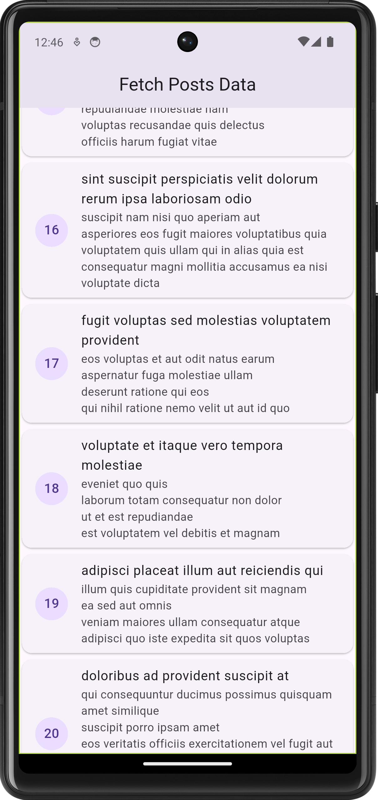

```markdown
# Swiftzel Test

A Flutter project demonstrating clean architecture, BLoC state management, and dependency injection using GetIt. The app fetches and displays posts from a remote API.

## Features

- Clean architecture (data, domain, presentation layers)
- BLoC for state management
- Dependency injection with GetIt
- Remote data fetching using Dio
- Network connectivity checks

## Getting Started

### Prerequisites

- Flutter SDK
- Dart
- Android Studio or VS Code

### Installation

1. Clone the repository:
   ```sh
   git clone https://github.com/yourusername/swiftzel_test.git
   cd swiftzel_test
   ```

2. Install dependencies:
   ```sh
   flutter pub get
   ```

3. Run the app:
   ```sh
   flutter run
   ```

## Screenshots



> Place your screenshot at `assets/screenshots/posts_page.png`.

## Project Structure

- `lib/feature/posts/data/` - Data layer (models, datasources, repositories)
- `lib/feature/posts/domain/` - Domain layer (entities, repositories, usecases)
- `lib/feature/posts/presentation/` - Presentation layer (BLoC, UI)
- `lib/core/` - Core utilities, network, errors
- `lib/injection_container.dart` - Dependency injection setup
- `lib/main.dart` - App entry point

## License

This project is licensed under the MIT License.
```